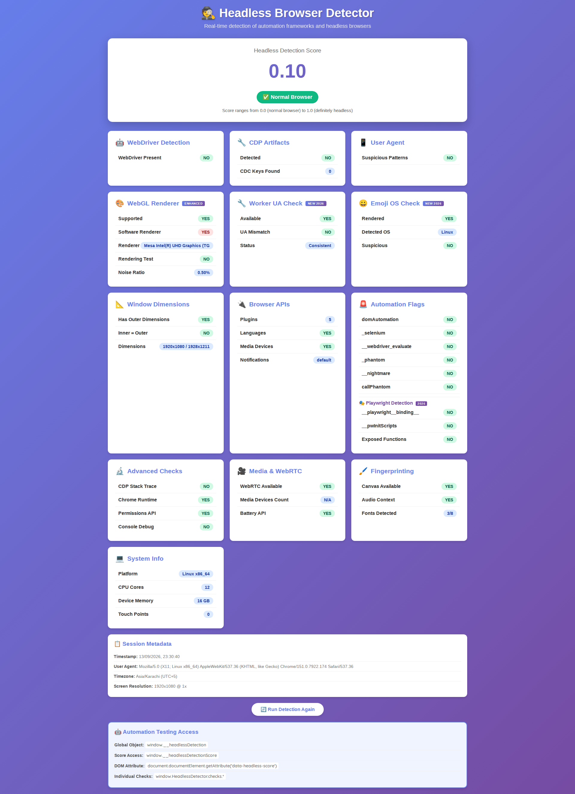
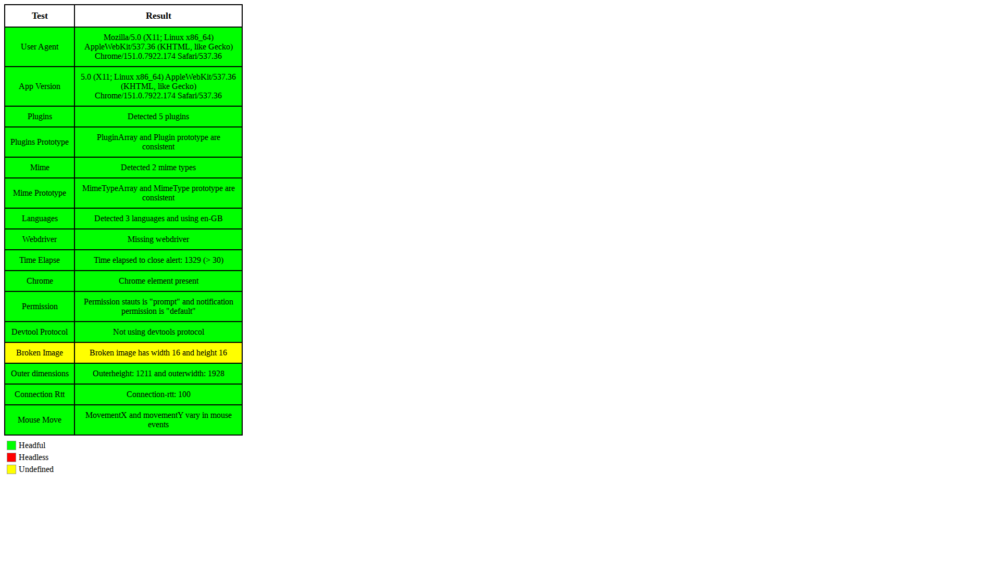

# `linux-native`

**Linux default.** Sites see **this Linux machine**: host GPU, fonts, screen, and CPU. Hexium does not sample a fake Linux GPU on this preset.

```python
from hexium_browser import launch

launch()                       # Linux → linux-native
launch(persona="linux-native")
```

Timezone, locale, languages, and WebRTC IP still follow **GeoIP** from the egress IP (default on). Explicit `timezone=` / `locale=` win.

UA is Chrome **151.0.7922.174**. Fingerprint patches that invent a different GPU are off; `fingerprint="off"` disables the rest of the engine fingerprint flags for A/B vs stock Chrome.

## Remap

`linux-native` on Windows or macOS remaps to that host’s native (`windows-native` / `macos-native`). For a sampled Linux Chrome identity on Linux, use [`linux-chrome`](linux-chrome.md) (opt-in).

## Headless captures

13 Sep 2026, `examples/linux-native/test_headless.py`. Screenshots, not a guarantee.

|  |  |
| --- | --- |
| [headless-detector.vercel.app](https://headless-detector.vercel.app/) — **0.10**, Normal Browser | [Infosimples](https://infosimples.github.io/detect-headless/) — Time Elapse pass |
