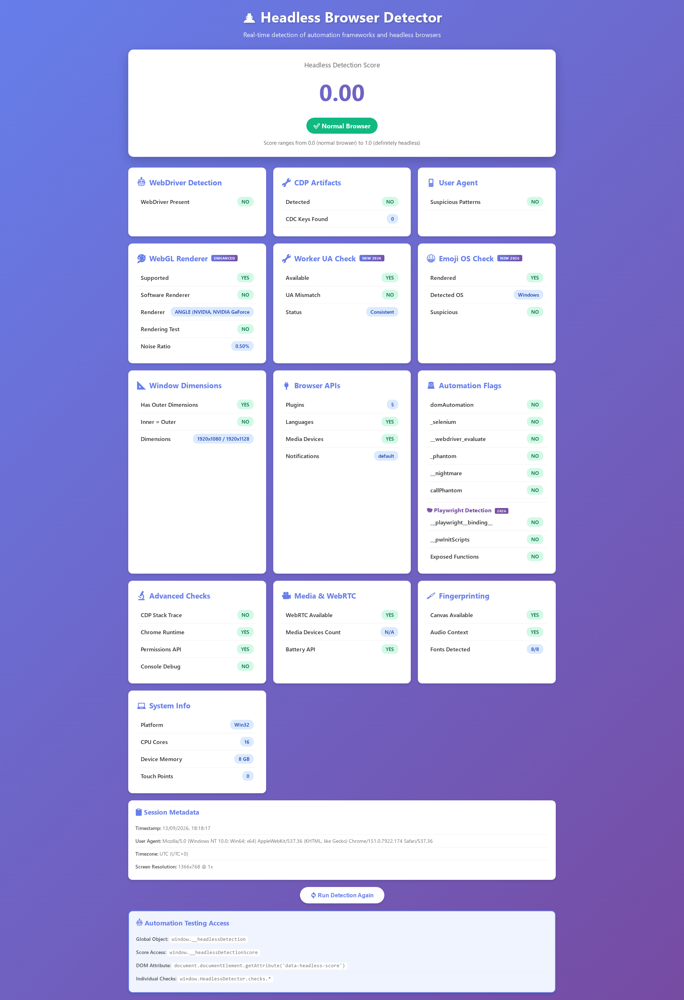
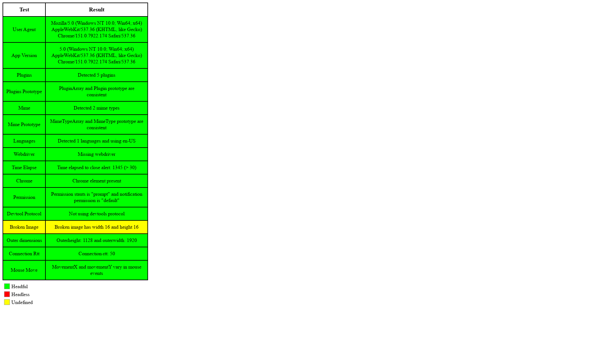

# `windows-chrome`

**Opt-in** on every OS (never remapped). Alias: `windows-1080p`.

Sites see **Win32 + Chrome 151**: sampled D3D11 WebGL / WebGPU, Segoe font pack, sampled screen/CPU/RAM. UA-CH `platformVersion` is clamped to **10.0.0** / **15.0.0** (never 19.0.0). UA is rewritten to **151.0.7922.174**. Desktop UA-CH `model` is empty.

```python
from hexium_browser import launch

launch(persona="windows-chrome")
launch(persona="windows-chrome", fingerprint="account-1")
```

## Linux host

Needs a Segoe pack. The wrapper ships `persona/data/fonts/windows`. Override with `HEXIUM_FONTS_DIR` if you keep fonts elsewhere. Without fonts, launch refuses rather than mix Linux fonts into a Win32 UA.

**Known tell:** on Linux, WebGL **pixels** can disagree with the spoofed renderer **name** (about −5% vs real Windows Chrome). That pixel-vs-name mismatch is **not** claimed fixed. Do not treat “hash matches Windows” as a guarantee.

## Headless captures

13 Sep 2026, `examples/win/test_headless.py` on a Linux host. Screenshots, not a guarantee.

|  |  |
| --- | --- |
| [headless-detector.vercel.app](https://headless-detector.vercel.app/) — **0.00**, Normal Browser | [Infosimples](https://infosimples.github.io/detect-headless/) — Time Elapse pass |

## GeoIP

Timezone/locale still come from the egress IP (default on). GeoIP does not re-roll the GPU. Same `fingerprint=` / named `profile=` keeps the sampled machine.
